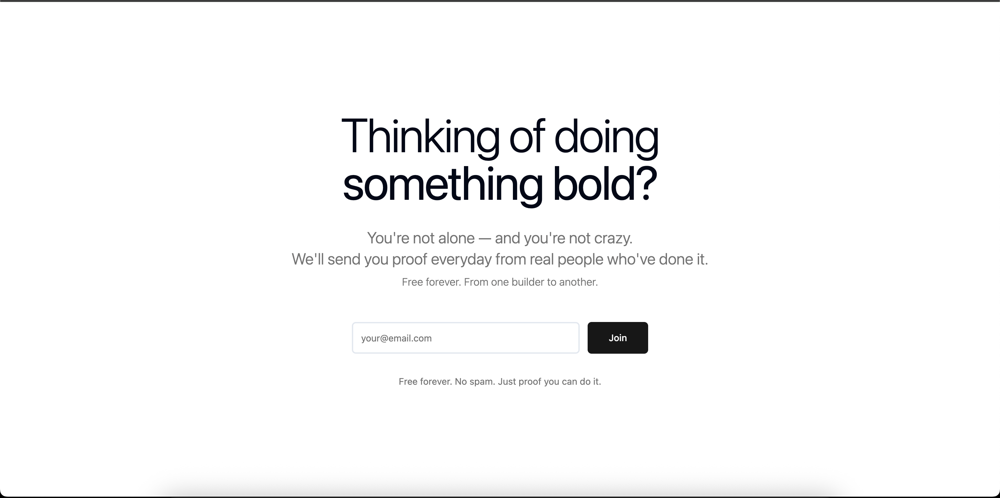
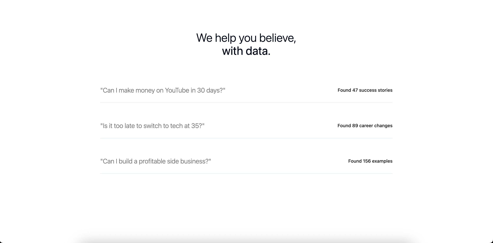
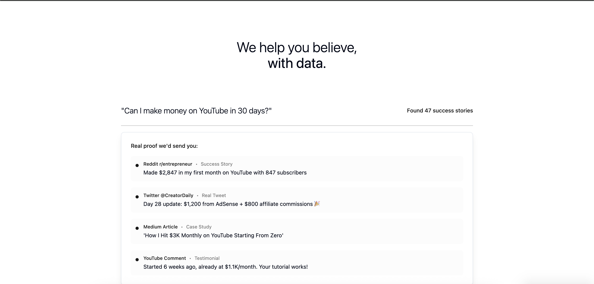

# Eviden

## What is Eviden?

Eviden is an app designed to help you break your limiting beliefs and take action on your boldest ideas. Every day, Eviden sends you real-world data and stories showing what others have achieved—reminding you that what you’re dreaming of is not impossible. Our mission is to push you to start, by proving that people just like you have already done it.

- **Daily Proof:** Get inspiring examples and data in your inbox every day.
- **Real Stories:** See what real people have accomplished, not just theory.
- **No Spam:** Only motivation and evidence, never junk.

> **You’re not alone. You’re not crazy. You can do it.**

---

## Features

- Collects your email and (optionally) your big idea or challenge
- Sends you daily proof and stories tailored to your interests
- Built with React, TypeScript, Supabase, and Tailwind CSS

---

## Screenshots

### Landing Page & Waiting List

### Use Case Examples

### Information Example

---

## Getting Started

1. Clone the repository
2. Install dependencies: `npm install`
3. Start the development server: `npm run dev`

---

## Tech Stack
- React
- TypeScript
- Supabase
- Tailwind CSS
- shadcn/ui

---

## License
MIT
